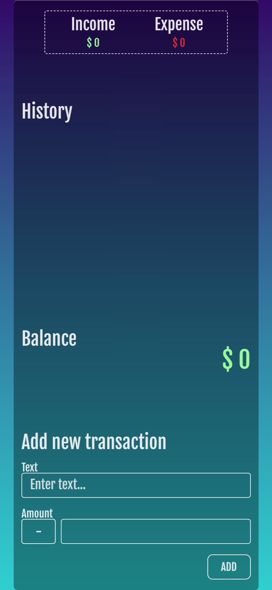

# Vue 3 Expense Tracker

A modern personal expense tracking application developed with Vue 3 and Vite, focusing on user experience and efficient financial management.

## Preview

Here's a sneak peek of our Expense Tracker in action:

### Desktop View


### Mobile View



## Features

- Dynamic balance display: Real-time reflection of current financial status
- Income and expense overview: Clear presentation of total income and expenses
- Transaction history: Scrollable list supporting a large number of transactions
- Add new transactions: Simple and intuitive interface for income and expense entries
- Delete transactions: Easily remove unwanted transaction records
- Responsive design: Adapts to devices with various screen sizes
- Local data storage: Utilizes localStorage to save transaction data

## Technology Stack

- Vue.js 3.4.15
- Vite 5.1.0
- Vue Composition API

## Installation

1. Clone the repository:

```
git clone https://github.com/yuch3nchen/vue3-expense-tracker.git
```

2. Navigate to the project directory:

```
cd vue3-expense-tracker
```

3. Install dependencies:

```
npm install
```

4. Run the development server:

```
npm run dev
```

5. Build for production:

```
npm run build
```

## Usage Guide

1. Add a transaction: Enter transaction description and amount in the "Add new transaction" area, then click the "ADD" button.
2. View balance: Current balance is displayed at the top of the page.
3. Check income/expense: View total income and expenses in the "Income" and "Expense" areas.
4. Transaction history: All transactions are listed in the "History" section.
5. Delete a transaction: Hover over a transaction record and click the "delete?" button that appears to remove the transaction.

## Project Structure

- `src/`:
- `App.vue`: Main application component
- `components/`:
- `AddTransaction.vue`: Form component for adding new transactions
- `Balance.vue`: Component displaying current balance
- `IncomeExpense.vue`: Component showing total income and expenses
- `TransactionList.vue`: Component displaying transaction history
- `vite.config.js`: Vite configuration file

## Contributing

Pull requests are welcome. For major changes, please open an issue first to discuss what you would like to change.

## License

[MIT LICENSE](LICENSE)

## Contact

If you have any questions or suggestions, please feel free to contact me:

- Email: yuch3nchen@gmail.com
- GitHub: [@yuch3nchen](https://github.com/yuch3nchen)
